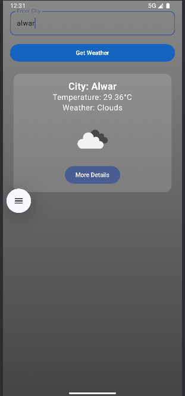
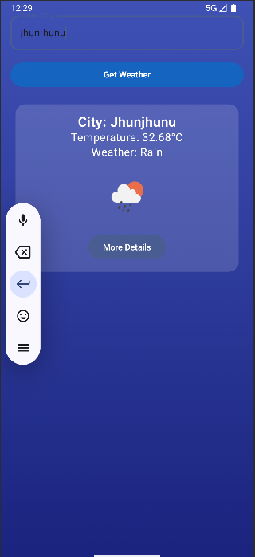

# 🌤️ Weather App (Jetpack Compose)

A beautifully designed Android weather app that displays real-time weather data using the OpenWeatherMap API. Built entirely with **Jetpack Compose**, **Kotlin**, and **MVVM architecture**.

---

## 🚀 Features

- 🔍 Search weather by **city name**
- 🌙 **Dark Mode** support
- 🎨 **Dynamic background** based on weather (rainy, cloudy, sunny, etc.)
- 🧾 Bottom sheet with **detailed weather info** (humidity, pressure, wind)
- 🌐 Live data using **Retrofit** and **OpenWeatherMap API**
- 🧠 Clean **MVVM** structure with ViewModel

---

## 🖼️ UI Preview

| Light Mode | Dark Mode |
|------------|-----------|
|  |  |


---

## 🛠️ Tech Stack

- **Kotlin**
- **Jetpack Compose**
- **Retrofit**
- **Gson**
- **Coroutines**
- **MVVM Architecture**
- **Material 3 UI**

---
## 🔗 Download APK

[⬇️ Download app-release.apk](https://github.com/Priya-lamba/WeatherApp/releases/download/v1.0/app-debug.apk)


## 🔧 Setup Guide

1. **Clone the repo**:

```bash
git clone  https://github.com/Priya-lamba/WeatherApp.git
cd WeatherApp
